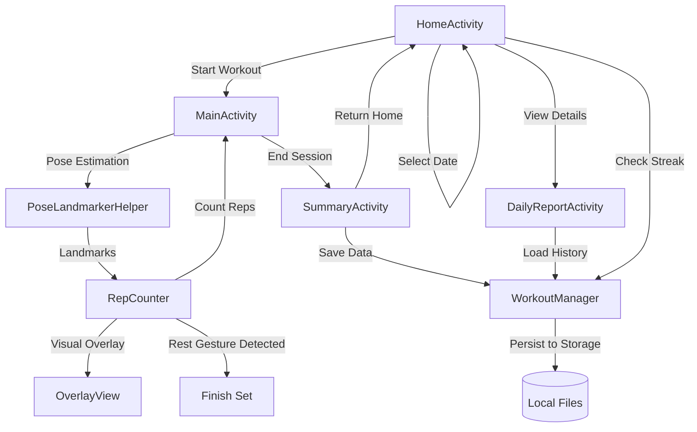

# Application Workflow

### Key Components:
- **HomeActivity**: Entry point with streak tracking and historical reports.
- **MainActivity**: Real-time workout tracking using MediaPipe.
- **RepCounter**: Core logic for exercise detection (Bicep Curls, Squats) and rest gestures.
- **SummaryActivity**: Post-workout breakdown and heat-map visualization.
- **WorkoutManager**: Data persistence layer using file serialization.
- **MuscleHeatmapView**: Custom view for rendering anatomical muscle intensity.
